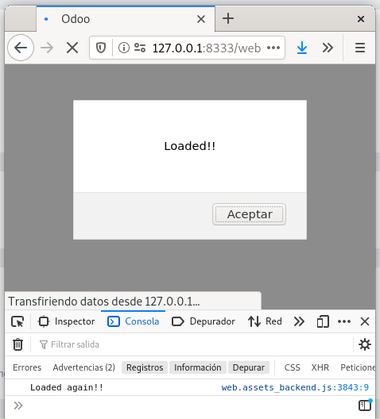
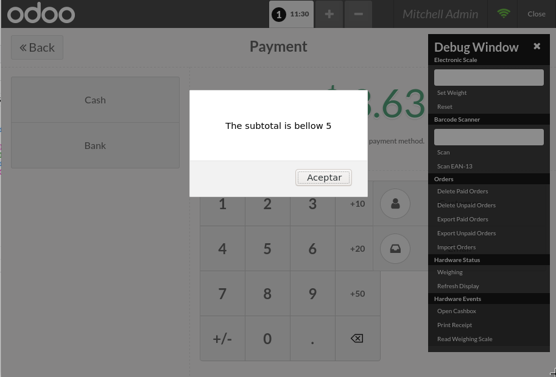

# js_framework_sample

Odoo 13 addon from [Odoo Mates](https://www.youtube.com/channel/UCVKlUZP7HAhdQgs-9iTJklQ) video tutorials.

- [Introduction To Odoo JavaScript Development](https://www.youtube.com/watch?v=VuUMvzycXQY).

- [How To Modify Existing JavaScript Widget - Odoo Point Of sale Development](https://www.youtube.com/watch?v=GGKd7aCp-pM).

This module is part of [Odoo Javascript tutorials](https://www.youtube.com/c/OdooMates/search?query=odoo%20javascript).

## Screenshot Addon

---

